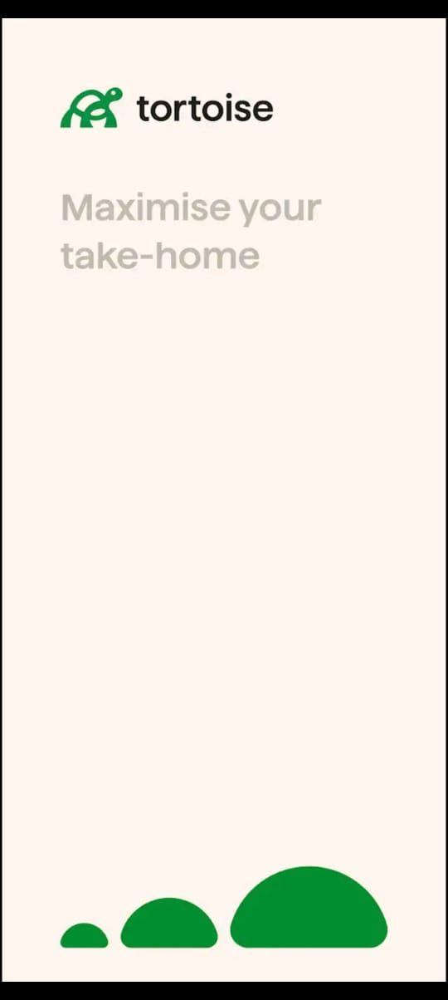
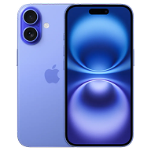
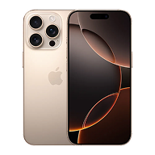

# 🐢 Tortoise_UI

A modern, multi-platform Flutter UI for device shopping — pixel-perfect, elegant, and lightning fast.



## ✨ Features

- 🎨 Beautiful, responsive UI for mobile, web, and desktop
- 🌗 Light & Dark mode support
- 🛒 Product listing with ratings, discounts, and badges
- 📦 Product details with animated shipping banner, color & storage pickers
- 🎉 Delightful Add to Cart effects (confetti, GIFs)
- 🔍 Brand selector with interactive design
- 🧩 Modular, maintainable codebase (BLoC, Freezed, GoRouter, GetIt)
- ⚡️ Blazing fast with static data and design tokens

## 📱 Screenshots

| Home Page | Product Details | Add to Cart |
|-----------|----------------|-------------|
|  |  |  |

## 🚀 Getting Started

1. **Clone the repo:**
   ```sh
   git clone https://github.com/ArpitGupta4957/Tortoise_UI.git
   cd Tortoise_UI
   ```

2. **Install dependencies:**
   ```sh
   flutter pub get
   ```

3. **Run the app:**
   ```sh
   flutter run
   ```

   > Supports Android, iOS, Web, Windows, Linux, and macOS.

## 🛠️ Project Structure

- `lib/` — Main source code
  - `presentation/` — UI widgets & screens
  - `domain/` — Data models
  - `application/` — BLoC & business logic
  - `assets/` — Images, icons, GIFs

## 💡 Design Highlights

- **Pixel-perfect:** Matches Figma/screenshot designs
- **Animated:** Marquee shipping, confetti, and more
- **Accessible:** Large touch targets, readable fonts
- **Customizable:** Easy to theme and extend

## 🤝 Contributing

Pull requests are welcome! For major changes, please open an issue first.

## 📄 License

This project is licensed under the MIT License.
